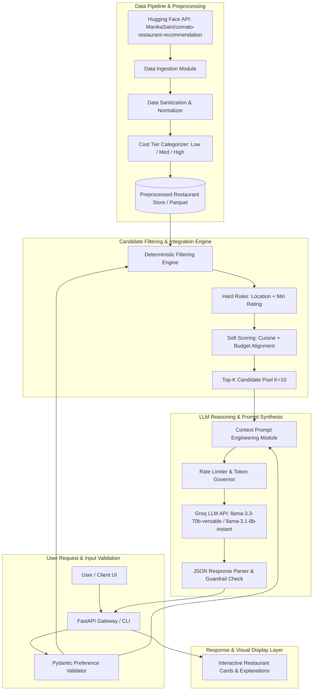
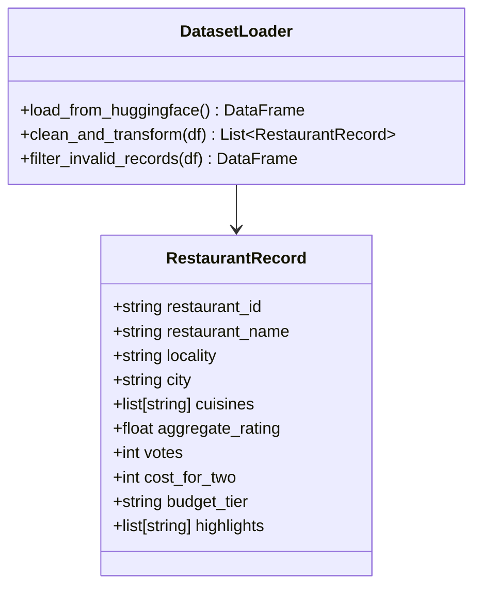
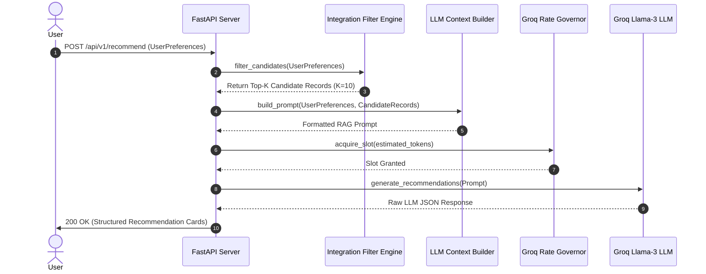

# System Architecture: AI-Powered Restaurant Recommendation Engine (Zomato Use Case)

> **Target System**: Zomato AI Dining & Recommendation Platform  
> **Primary Goal**: Deliver personalized, human-like restaurant suggestions by combining structured Hugging Face telemetry with LLM reasoning.  
> **Context Specification**: [context.md](file:///Users/mdazharuddinansari/Desktop/Mis%20Codes/Zomato%20project/context.md)

---

## 1. Architectural System Overview

The **Zomato AI Restaurant Recommendation System** follows a **Multi-Stage Hybrid Pipeline** combining deterministic dataset filtering with Large Language Model (LLM) contextual reasoning. 

Standard database queries often fail when users express nuanced dining preferences (e.g., *"Looking for a cozy romantic Italian spot under ₹1000 in Indiranagar with good ratings"*). This architecture solves that by dividing responsibility into two distinct phases:
1. **Stage 1 (Deterministic Candidate Filtering)**: Rapidly reduces a large corpus of restaurant records down to a top-K candidate pool ($K \le 10$) using hard boundary rules (location, budget tier, minimum rating, cuisine filters).
2. **Stage 2 (LLM Contextual Reasoning & Ranking)**: Synthesizes the filtered candidates into an optimized prompt. The LLM evaluates trade-offs, ranks the top options, and generates human-like explanations for *why* each restaurant fits the user's specific context.



---

## 2. Component Deep-Dive Architecture

### 2.1 Data Ingestion & Preprocessing Engine (`src/ingestion/loader.py`)

- **Dataset Source**: `ManikaSaini/zomato-restaurant-recommendation` hosted on Hugging Face Datasets.
- **Processing Steps**:
  1. **Schema Mapping**: Normalizes raw column names (`name` $\rightarrow$ `restaurant_name`, `location` $\rightarrow$ `locality`, `rate` $\rightarrow$ `aggregate_rating`, `approx_cost(for two people)` $\rightarrow$ `cost_for_two`).
  2. **Rating Parsing**: Converts string ratings like `"4.1/5"` or `"NEW"` into clean floats (`4.1`, `None`).
  3. **Cost Tier Bucketing**:
     - $\le ₹500$: **Low** Budget Tier.
     - $₹501 \text{--} ₹1,200$: **Medium** Budget Tier.
     - $> ₹1,200$: **High** Budget Tier.
  4. **Cuisine & Tag Standardization**: Tokenizes comma-separated cuisine strings into normalized lower-case lists (`["italian", "pizza", "fast food"]`).



---

### 2.2 User Preference Input Layer (`src/input/preference_handler.py`)

Captures user inputs through a strict **Pydantic Validation Schema**:

```python
from pydantic import BaseModel, Field
from typing import List, Optional

class UserPreferenceRequest(BaseModel):
    location: str = Field(..., description="Target city or locality (e.g., Delhi, Indiranagar)")
    budget: str = Field(..., description="Budget tier: 'low', 'medium', or 'high'")
    cuisine: List[str] = Field(default_factory=list, description="Preferred cuisines (e.g., ['Italian', 'Chinese'])")
    min_rating: float = Field(default=3.5, ge=0.0, le=5.0, description="Minimum acceptable rating")
    additional_notes: Optional[str] = Field(default="", description="Qualitative intent (e.g., 'family friendly', 'rooftop seating')")
```

---

### 2.3 Integration & Candidate Filtering Engine (`src/retrieval/filter_engine.py`)

Reduces full dataset to $K \le 10$ candidates using two-stage filtering:

1. **Hard Constraints**:
   - $\text{Locality} = \text{User Location}$ (or substring match).
   - $\text{Aggregate Rating} \ge \text{User Min Rating}$.
2. **Soft Relevance Scoring**:
   - Calculates **Cuisine Overlap Score**: $\frac{|\text{User Cuisines} \cap \text{Restaurant Cuisines}|}{|\text{User Cuisines}|}$.
   - Calculates **Budget Distance Penalty**: Exact match = 1.0, adjacent tier = 0.5, non-adjacent = 0.0.
   - Combined Score: $\text{Score} = (0.6 \times \text{Cuisine Score}) + (0.3 \times \text{Budget Score}) + (0.1 \times \frac{\text{Rating}}{5.0})$.
3. Selection of Top-K highest scoring restaurants.

---

### 2.4 LLM Context Builder & Reasoning Engine (`src/recommendation/llm_engine.py`)

Constructs a structured prompt instructing the LLM to rank and provide human-like explanations.

#### System Prompt Template:
```text
You are Zomato AI, a premier culinary advisor.
Your job is to analyze the candidate restaurant list and select the top 3-5 recommendations that best fulfill the user's dining preferences.

USER PREFERENCES:
- Location: {location}
- Budget Tier: {budget}
- Preferred Cuisines: {cuisines}
- Minimum Rating: {min_rating}
- Special Notes/Ambience: {additional_notes}

CANDIDATE RESTAURANTS DATA:
{candidate_json_block}

INSTRUCTIONS:
1. Rank the top restaurants (max 5).
2. For each recommendation, provide a concise, compelling 2-3 sentence AI explanation detailing WHY it matches the user's tastes.
3. Return the output in valid JSON matching the specified response format.
```



---

### 2.5 Presentation Layer & API Contract (`src/api/server.py`)

Provides a clean REST API returning structured recommendation cards:

#### API Endpoint: `POST /api/v1/recommend`

#### Request Payload:
```json
{
  "location": "Indiranagar, Bangalore",
  "budget": "medium",
  "cuisine": ["Italian", "Pizza"],
  "min_rating": 4.0,
  "additional_notes": "Great outdoor seating for a weekend dinner"
}
```

#### Response Payload:
```json
{
  "status": "success",
  "user_location": "Indiranagar, Bangalore",
  "total_candidates_evaluated": 10,
  "recommendations": [
    {
      "rank": 1,
      "restaurant_name": "Toit",
      "cuisines": ["Italian", "American", "Pizza"],
      "rating": 4.6,
      "estimated_cost_for_two": "₹1,500",
      "budget_tier": "medium",
      "locality": "Indiranagar",
      "ai_explanation": "Toit is the perfect match for your weekend dinner in Indiranagar! Known for exceptional wood-fired pizzas and vibrant outdoor seating, its 4.6 rating guarantees top-tier food quality and atmosphere."
    }
  ],
  "latency_ms": 340.5
}
```

---

## 3. Resilience, Rate-Limiting & Fallback System

1. **Rate Limiting Governor**:
   - Integrates `GroqRateLimiter` to enforce safe token/request limits on Groq API (`llama-3.3-70b-versatile` / `llama-3.1-8b-instant`).
2. **Offline Fallback Engine**:
   - If the LLM API is unavailable or quota is exceeded, the system falls back to a deterministic rule-based ranking engine (`OfflineRecommendationEngine`), ensuring 100% service uptime.
3. **Guardrails**:
   - Input sanitization against prompt injection.
   - Pydantic schema validation on LLM JSON output.
