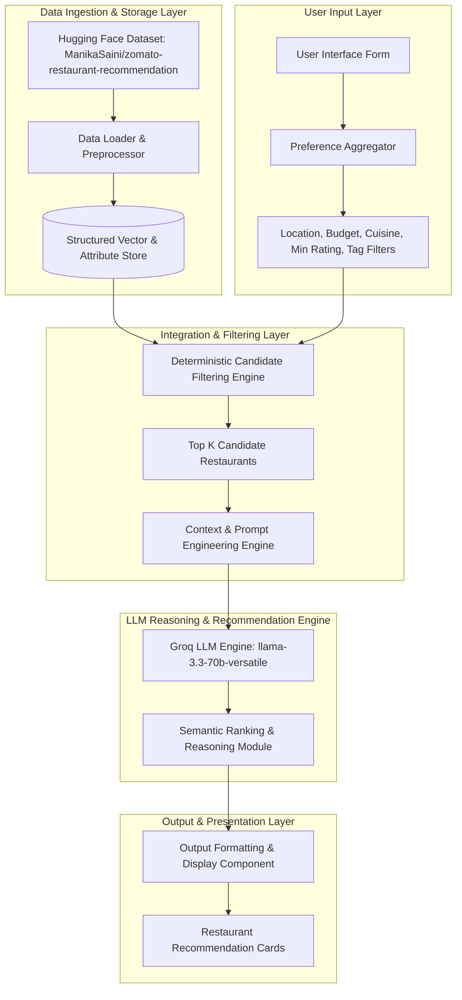

# AI-Powered Restaurant Recommendation System (Zomato Use Case) - System Context

## 1. Project Overview & System Purpose

The **AI-Powered Restaurant Recommendation System** is an intelligent dining recommendation service inspired by Zomato. Its core objective is to deliver personalized, human-like, and context-aware restaurant recommendations by combining structured restaurant datasets with Large Language Models (LLMs).

Unlike traditional keyword-matching or simple database filtering tools, this system leverages LLM reasoning to explain *why* specific restaurants match a user's unique dining intent, taste preferences, budget constraints, and occasion needs.

---

## 2. Primary Objectives

- **User Preference Aggregation**: Seamlessly capture multi-attribute user criteria including location, budget tier, cuisine style, minimum rating thresholds, and qualitative preferences (e.g., romantic ambiance, quick bites, family-friendly).
- **Real-World Dataset Integration**: Ingest and structure real-world restaurant telemetry from Hugging Face (`ManikaSaini/zomato-restaurant-recommendation`).
- **LLM-Powered Reasoning & Ranking**: Utilize advanced LLM prompt engineering to filter, rank, and synthesize candidates into tailored recommendations accompanied by natural language justifications.
- **Rich Output Presentation**: Present top recommendations in an intuitive, structured visual format featuring restaurant metadata and personalized AI explanations.

---

## 3. End-to-End System Workflow & Pipeline Architecture

---

## 4. Architectural Layer Specifications

### 4.1 Data Ingestion & Preprocessing Layer
- **Source**: [ManikaSaini/zomato-restaurant-recommendation](https://huggingface.co/datasets/ManikaSaini/zomato-restaurant-recommendation) on Hugging Face.
- **Extracted Fields**:
  - `restaurant_name`: Name of the dining establishment.
  - `location` / `city` / `locality`: Geographic location details.
  - `cuisines`: List or comma-separated string of supported cuisines.
  - `approx_cost`: Estimated cost for two people (numerical / bucketed).
  - `aggregate_rating` / `rating_text` / `votes`: Customer ratings and review volume.
  - `highlights` / `facilities`: Delivery status, dining type, family-friendly, ambiance tags.

### 4.2 User Input Layer
Captures structured and unstructured preferences:
- **Location**: Specific city or neighborhood (e.g., Delhi, Bangalore, Connaught Place, Indiranagar).
- **Budget Tier**:
  - *Low*: Affordable / Street Food / Pocket-Friendly ($ / ₹).
  - *Medium*: Casual Dining / Moderate ($$ / ₹₹).
  - *High*: Fine Dining / Premium ($$$ / ₹₹₹).
- **Cuisine Preferences**: Primary and secondary cuisines (e.g., Italian, North Indian, Chinese, Mughlai, South Indian).
- **Minimum Rating**: Rating threshold (e.g., $\ge 4.0$).
- **Additional Intent Signals**: Ambiance tags, dietary requirements (Veg/Non-Veg/Vegan), quick service, outdoor seating, or family-friendly options.

### 4.3 Integration Layer
- **Candidate Filtering**: Filters the full Zomato dataset down to top candidate matches using hard boundaries (Location match, Budget tier, Min Rating threshold).
- **Prompt Construction**: Formats the candidate restaurant list into a structured JSON/markdown context block inside the LLM prompt.
- **Reasoning Instructions**: Instructs the LLM to analyze the candidate list against the user's explicit and implicit preferences.

### 4.4 Recommendation Engine
- **LLM Reasoning**: Evaluates candidates, handles trade-offs (e.g., slightly higher budget for superior rating), and selects the top 3-5 recommendations.
- **Personalized Justifications**: Generates human-like explanations detailing *why* each restaurant was selected (e.g., "Ideal for your Italian cravings in Indiranagar with high ratings for wood-fired pizza").

### 4.5 Output Display Layer
Renders top recommendations cleanly:
- **Restaurant Name**
- **Cuisine / Specialties**
- **Aggregate Rating & Review Summary**
- **Estimated Cost for Two**
- **AI-Generated Personalized Explanation**

---

## 5. Summary Data Contract

| Output Field | Type | Description |
| :--- | :--- | :--- |
| `restaurant_name` | `string` | Official name of the recommended restaurant |
| `cuisines` | `List[string]` | Primary cuisine types offered |
| `rating` | `float` | Aggregate user rating (out of 5.0) |
| `estimated_cost` | `string / int` | Approximate cost for two people |
| `location` | `string` | Locality / City area |
| `ai_explanation` | `string` | Contextual, LLM-generated rationale matching user preferences |
