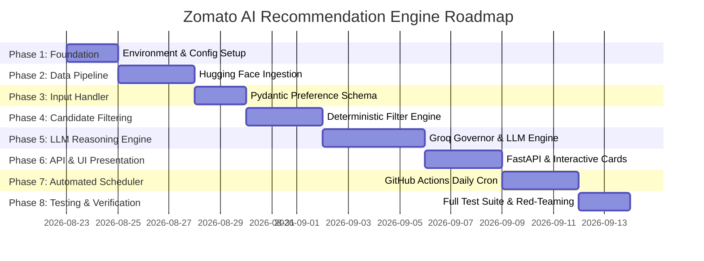

# Phase-Wise Implementation Plan: Zomato AI Restaurant Recommendation System

> **Target System**: AI-Powered Restaurant Recommendation Service (Zomato Use Case)  
> **Architecture Reference**: [Architecture.md](file:///Users/mdazharuddinansari/Desktop/Mis%20Codes/Zomato%20project/Architecture.md)  
> **Context Document**: [context.md](file:///Users/mdazharuddinansari/Desktop/Mis%20Codes/Zomato%20project/context.md)

---

## Executive Summary & Implementation Phases



---

### Phase 0 / Phase 1: Environment Setup, Directory Structure, Dependencies & Config (Days 1–2)

Establish the project repository structure, core environment variables, directory tree, and python dependency stack.

#### [NEW] [Zomato project/requirements.txt](file:///Users/mdazharuddinansari/Desktop/Mis%20Codes/Zomato%20project/requirements.txt)
- Include core dependencies: `datasets`, `pandas`, `pydantic`, `fastapi`, `uvicorn`, `groq`, `requests`, `pyarrow`, `python-dotenv`.

#### [NEW] [Zomato project/.env.example](file:///Users/mdazharuddinansari/Desktop/Mis%20Codes/Zomato%20project/.env.example)
- Environment variable definitions for `GROQ_API_KEY`, `GROQ_LLM_MODEL`, and data paths.

#### [NEW] [Zomato project/src/config.py](file:///Users/mdazharuddinansari/Desktop/Mis%20Codes/Zomato%20project/src/config.py)
- Configuration management module:
  - Hugging Face Dataset path: `ManikaSaini/zomato-restaurant-recommendation`
  - Groq API credentials & model specs (`GROQ_API_KEY`, `llama-3.3-70b-versatile`, `llama-3.1-8b-instant`)
  - Cost tier boundaries ($\le ₹500 \rightarrow \text{Low}$, $₹501 \text{--} ₹1200 \rightarrow \text{Medium}$, $> ₹1200 \rightarrow \text{High}$)
  - Directory constants (`DATA_DIR`, `RAW_DATA_DIR`, `PROCESSED_DATA_DIR`, `OUTPUTS_DIR`)
  - Candidate pool size limit ($K = 10$)

---

### Phase 2: Hugging Face Data Ingestion & Preprocessing Pipeline (Days 3–5)

Fetch, clean, and normalize the Zomato restaurant dataset from Hugging Face into a clean structured store.

#### [NEW] [src/ingestion/loader.py](file:///Users/mdazharuddinansari/Desktop/Mis%20Codes/Zomato%20project/src/ingestion/loader.py)
- **Dataset Loader & Cleaning Pipeline**:
  - Downloads `ManikaSaini/zomato-restaurant-recommendation` using Hugging Face `datasets` library.
  - Normalizes raw field names (`name` $\rightarrow$ `restaurant_name`, `location` $\rightarrow$ `locality`, `rate` $\rightarrow$ `aggregate_rating`, `approx_cost(for two people)` $\rightarrow$ `cost_for_two`).
  - Converts string ratings like `"4.1/5"` to clean floats (`4.1`).
  - Categorizes numeric cost into `budget_tier` (`low`, `medium`, `high`).
  - Exports preprocessed records to `data/processed/clean_zomato_restaurants.parquet`.

---

### Phase 3: User Preference Input & Validation Layer (Days 6–7)

Build a robust input validation layer using Pydantic schemas to sanitize user preferences.

#### [NEW] [src/input/preference_handler.py](file:///Users/mdazharuddinansari/Desktop/Mis%20Codes/Zomato%20project/src/input/preference_handler.py)
- **Pydantic Validation Models**:
  - `UserPreferenceRequest`: Fields for `location` (string), `budget` (`low` | `medium` | `high`), `cuisine` (`List[str]`), `min_rating` (`float` between 0.0 and 5.0), and `additional_notes` (optional text).
  - Enforces location normalization and string stripping.

---

### Phase 4: Deterministic Integration & Candidate Filtering Engine (Days 8–10)

Implement two-stage candidate reduction to filter thousands of restaurants down to top 10 relevant candidates.

#### [NEW] [src/retrieval/filter_engine.py](file:///Users/mdazharuddinansari/Desktop/Mis%20Codes/Zomato%20project/src/retrieval/filter_engine.py)
- **Candidate Filtering Module**:
  - **Hard Constraints**: Location substring matching + Minimum Rating threshold ($\text{rating} \ge \text{min\_rating}$).
  - **Soft Relevance Scoring**:
    - Cuisine Overlap Score: $\frac{|\text{User Cuisines} \cap \text{Restaurant Cuisines}|}{|\text{User Cuisines}|}$
    - Budget Distance Score: Exact tier match = 1.0, adjacent tier = 0.5, non-adjacent = 0.0.
    - Combined Score: $\text{Score} = (0.6 \times \text{Cuisine Score}) + (0.3 \times \text{Budget Score}) + (0.1 \times \frac{\text{Rating}}{5.0})$.
  - Sorts and selects top $K=10$ candidate restaurants.

---

### Phase 5: Groq Rate Governor & LLM Reasoning Recommendation Engine (Days 11–14)

Build the LLM prompt synthesis, rate governor, and reasoning recommendation engine powered by Groq.

#### [NEW] [src/recommendation/groq_rate_limiter.py](file:///Users/mdazharuddinansari/Desktop/Mis%20Codes/Zomato%20project/src/recommendation/groq_rate_limiter.py)
- Enforces Groq API limits (30 RPM, 12K TPM, 1K RPD, 100K TPD) for `llama-3.3-70b-versatile` with exponential backoff and jitter.

#### [NEW] [src/recommendation/llm_engine.py](file:///Users/mdazharuddinansari/Desktop/Mis%20Codes/Zomato%20project/src/recommendation/llm_engine.py)
- **LLM Reasoning & Recommendation Module**:
  - Dynamically builds RAG system prompt with user preferences and top 10 candidate JSON block.
  - Calls Groq LLM API (`llama-3.3-70b-versatile`) to rank top 3-5 restaurants.
  - Generates personalized, human-like AI explanations detailing *why* each restaurant fits the user's specific context.

#### [NEW] [src/recommendation/offline_fallback.py](file:///Users/mdazharuddinansari/Desktop/Mis%20Codes/Zomato%20project/src/recommendation/offline_fallback.py)
- Rule-based offline recommendation engine activated if LLM API limits are reached.

---

### Phase 6: Backend API Layer & FastAPI Server (Days 15–16)

Build the production FastAPI server exposing RESTful endpoints with CORS middleware, validation error handling, and structured JSON output schemas.

#### [NEW] [src/api/server.py](file:///Users/mdazharuddinansari/Desktop/Mis%20Codes/Zomato%20project/src/api/server.py)
- **FastAPI Production Web Server**:
  - `POST /api/v1/recommend`: Main recommendation endpoint accepting `UserPreferenceRequest` payload and returning Top-5 AI-ranked recommendations with Groq explanations.
  - `GET /api/v1/health`: System health check endpoint.
  - `GET /api/v1/locations`: Endpoint returning supported localities (e.g., Bellandur, Indiranagar, Koramangala, Whitefield, Connaught Place).
  - CORS middleware enabled for seamless frontend integration.

---

### Phase 7: Premium Interactive Web Frontend UI (Days 17–19)

Build a state-of-the-art, high-aesthetic web interface for the Zomato AI Restaurant Recommendation System.

#### [NEW] [src/frontend/static/style.css](file:///Users/mdazharuddinansari/Desktop/Mis%20Codes/Zomato%20project/src/frontend/static/style.css)
- **Modern Design System & Styling**:
  - Dark mode glassmorphism theme with Zomato Red accent palette (`#E23744`, `#FF5260`, `#111827`, `#1F2937`).
  - Google Fonts (`Outfit` & `Inter`).
  - Micro-animations, glowing card highlights, and smooth hover effects.

#### [NEW] [src/frontend/static/app.js](file:///Users/mdazharuddinansari/Desktop/Mis%20Codes/Zomato%20project/src/frontend/static/app.js)
- **Interactive UI Logic & Fetch Handler**:
  - Preference Input Form (Location dropdown/autocomplete for Bellandur, Indiranagar, etc., Budget Tier selector buttons, Min Rating slider, Cuisine tag multi-select, Notes).
  - Async API integration calling `POST /api/v1/recommend`.
  - Skeleton loader animations during LLM reasoning.
  - Dynamic recommendation card rendering featuring rating badges, cuisine pills, cost badges, and AI explanation callout boxes.

#### [NEW] [src/frontend/templates/index.html](file:///Users/mdazharuddinansari/Desktop/Mis%20Codes/Zomato%20project/src/frontend/templates/index.html)
- Responsive HTML5 single-page application layout.

---

### Phase 8: Automated Daily Dataset Refresh Scheduler via GitHub Actions (Days 20–21)

Automate daily data sync from Hugging Face to ensure restaurant ratings and costs remain up to date.

#### [NEW] [.github/workflows/zomato_daily_ingestion.yml](file:///Users/mdazharuddinansari/Desktop/Mis%20Codes/Zomato%20project/.github/workflows/zomato_daily_ingestion.yml)
- **GitHub Actions Scheduled Cron Workflow**:
  - Scheduled Cron: `0 5 * * *` (Runs daily at 05:00 AM UTC / **10:30 AM IST**).
  - Manual Trigger: `workflow_dispatch` enabled.
  - Executes `python -m src.scheduler.daily_refresh_cron` to refresh dataset files.

#### [NEW] [src/scheduler/daily_refresh_cron.py](file:///Users/mdazharuddinansari/Desktop/Mis%20Codes/Zomato%20project/src/scheduler/daily_refresh_cron.py)
- Cron runner downloading delta dataset updates from Hugging Face and updating `data/processed/clean_zomato_restaurants.parquet`.

---

### Phase 9: Testing, Verification & Red-Teaming (Days 22–23)

Execute comprehensive unit and integration testing.

#### [NEW] [tests/test_zomato_pipeline.py](file:///Users/mdazharuddinansari/Desktop/Mis%20Codes/Zomato%20project/tests/test_zomato_pipeline.py)
- Test suite covering:
  - Dataset loading and cost bucketing.
  - Candidate filtering accuracy.
  - Groq rate limiter logic.
  - End-to-end API recommendation payload verification.

---

## Verification & Execution Plan

### Automated Tests
- Run PyTest test suite:
  ```bash
  python -m unittest discover -s tests -p "test_*.py"
  ```

### Manual Verification
- Run `python main_zomato_demo.py` with varied inputs (e.g., Delhi Street Food, Bangalore Fine Dining Italian, Quick Bites under ₹400).
- Verify 100% adherence to response JSON payload contracts and personalized AI explanations.
